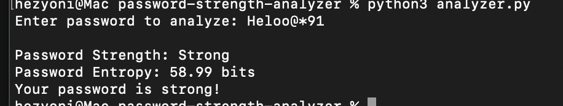
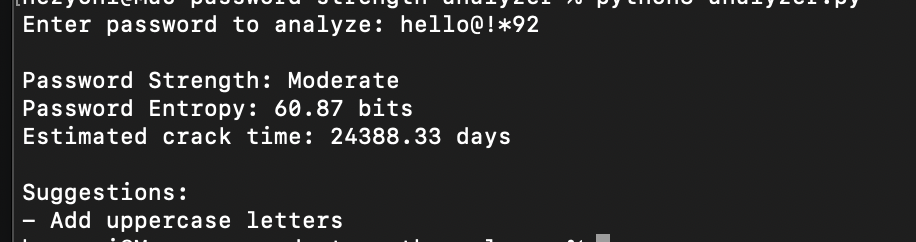
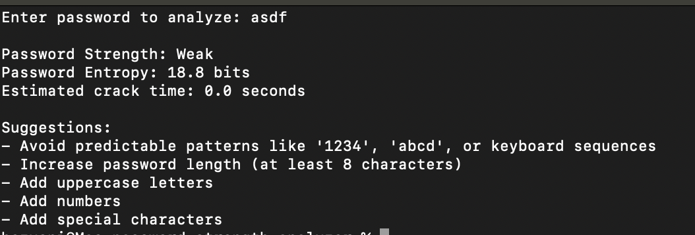

# Password Strength Analyzer

A Python-based cybersecurity tool that evaluates password strength using security best practices such as complexity checks, entropy calculation, and detection of weak or predictable patterns.

This tool helps users understand how secure their passwords are and provides suggestions to improve them.

---

## Features

* Password complexity analysis (length, uppercase, lowercase, numbers, special characters)
* Detection of commonly used weak passwords
* Detection of predictable patterns (e.g., `1234`, `abcd`, `qwerty`)
* Password entropy calculation
* Estimated brute-force crack time
* Security improvement suggestions

---

## Technologies

* Python
* Regular Expressions (Regex)
* Basic Cryptography Concepts
* Security Analysis

---

## Usage

Run the analyzer with:

```bash
python3 analyzer.py
```

Example run:

```
Enter password to analyze: Hello123

Password Strength: Moderate
Password Entropy: 41.7 bits
Estimated crack time: 3.2 hours

Suggestions:
- Add special characters
- Avoid predictable patterns
```

---

## Sample Output

Example 1 – Weak password:

```
Enter password to analyze: password

Password Strength: Weak
Password Entropy: 18.0 bits
Estimated crack time: 0.01 seconds

Suggestions:
- This password appears in a common password list
- Add uppercase letters
- Add numbers
- Add special characters
```

Example 2 – Strong password:

```
Enter password to analyze: H@ckerSecure2026

Password Strength: Strong
Password Entropy: 67.3 bits
Estimated crack time: 24.6 years
```
---
## Screenshots

### Entropy Calculation



### Crack Time Detection



### Pattern Detection




---

## Educational Purpose

This project demonstrates fundamental cybersecurity concepts including password strength evaluation, entropy measurement, and brute-force attack estimation. It is designed for learning purposes and showcases how password auditing tools evaluate security.

---

## Author

GitHub: https://github.com/hezyoninimshiai-gif
